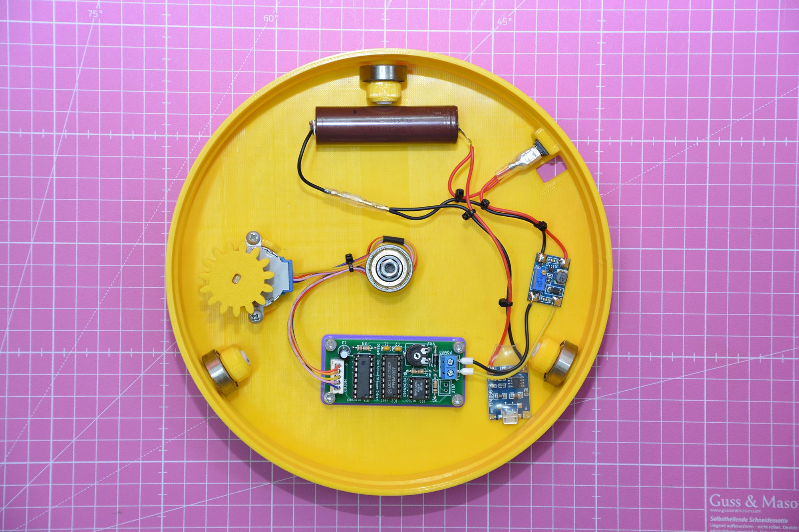

# OSSteD
OSSteD stands for: Old School Stepper Driver

This is an _old style_ stepper driver thought to be used with the popular _28BYJ-48_ Stepper Motor. I created this circuit for using it in conjunction with the [Rotating Table by Basement Creations](https://www.thingiverse.com/thing:4817279) I use for displaying object or taking videos of my stuff.

### Why "Old Style" ?
Times ago a couple of friends 3Dprinted that Rotating Table and built a stepper driver using an Arduino. When they published pictures of their work on social networks, some people complained about that saying things like:  

> This can be achieved using an NE555 too! Why waste a microcontroller?  
 
Yes, but that can be done using also 4 pushbuttons and putting a trained monkey in front of them that pushes buttons one at time sequentially but I did't read comment like this, very strange IMHO. It's clear that every task can be fullfilled in a lot of different ways but there is always someone ready to criticize because looks like we humans are made for this.

Anyway, since I had a lot of ancient ICs in my drawers (One of my hobbies is to repair vintage stuff) and I wanted to refresh some old electronics I learned during my school years, I made the stepper controller using an NE555, a decade counter and a darlington array IC. Now the remaining part of people can say stuff like:

> Why use so old components? They're fuc*ing expensive nowadays! An ATmega328 would be more cheap!  

Making all people happy to criticize every other's project. So, first than criticize, please let me see your trained monkey device. 

### How it works
An NE555 is configured as Astable Oscillator : this means the expensive NE555 will produce a square wave continuously. In this configuration frequency is determined by R1, R2 and C1 in the schematic. I keep fixed C1 at 100nF and R1 at 10K so you can vary frequency by varying R2. For R2 I used a 10K resistor in series to a 100K trimmer. Since frequency of astable oscillator is determined by formula:  
  
`f=1.44/((R1 + 2*R2)*C1)`

when trimmer is set to zero, R2=10K and then frequency is 480Hz (motor at maximum speed), then trimmer is all turned R2=110K and then frequency=62Hz.
I designed the PCB so you can use a trimmer mounted on PCB (VR1) OR an external potentiometer to be mounted on panel and attached to VR1E connector : only one of those 2 must be used.  
  
Frequency output from NE555 is sent to a 4017 decade counter for generating pulse waves for driving the 4 coils of the stepper motor from outputs  0,1,2,3. Output 4 is sent to reset input for making cycle start again. 4017 outputs are connected to an ULN2003 for the power driving. Usually you can obtain a small board with an ULN2003 together that motor when you buy it: from that board you can recover the IC, the IC socket and the motor connector.

### Notes
The 28BYJ-48 Stepper Motor is very slow so if you planned to use this motor like me, you can consider to put your phone in time-lapse mode for having a more fast video or you can elaborate the video after for increasing the speed. This motor has also a very low torque so must be used with a rotating plate having a reduction like the one I've linked in the introduction: many designs on internet connects that motor directly on the plate, this is no good and probably will fail (I've 3D printed one of this plate and as expected motor wasn't able to spin the table).

I found measures of the Rotating Table by Basement Creations has non accurate measures so probably you'll work a lot with file for adjusting parts and fit the  ball-bearings.

### BOM
* IC1	: NE555
* IC2	: CD4017
* IC3	: ULN2003 *
* R1	: 10K&#937; &#188;W
* R2	: 10K&#937; &#188;W
* R3	: 1K&#937; &#188;W
* C1	: 100nF 
* C2	: 100nF
* C3	: 10&#181;F 10V
* VR1	: Trimmer 100K&#937; **
* VR1E	: 2-pin JST-XH pcb male connector (+ external 100K potentiometer) **
* POWER	: 2-pin Screw Terminal
* MOTOR	: 5-pin JST-XH pcb male connector *

(*) You can salvage those components (+1 16 pin DIP IC socket) from a 28BYJ-48 Kit as one linked below
(**) Mount only 1: the VR1 Trimmer OR the VR1E connector+external potentiometer

Optionals:
* 1x 8-pin DIP IC socket
* 2x 16-pin DIP IC socket

### PCB
You can buy the pcb, and then support me, following those 2 steps:

Step 1: Subscribe to PCBWay using my invite link: [https://www.tinyurl.com/pcbwaysz](https://www.tinyurl.com/pcbwaysz)  
Step 2: Order the OSSteD PCB from the following link: [https://tinyurl.com/osstedpcb](https://tinyurl.com/osstedpcb)  

### STL
For an easy mounting internally to the rotating plate I designed a small stand: you can glue that stand internally to the plate and then screw the PCB on top of that stand using 4 M3 6mm screws

### Attachments
- [PCB Stand STL](./stl/OSSteD_stand.stl)
- [Schematic](./docs/OSSteD_schematic.pdf)
- [Gerbers](./gerbers) => Or [buy directly a PCB from PCBWay](https://tinyurl.com/osstedpcb)  
- [Datasheets](./docs/datasheets/)

### Other parts you need
If you want to build the rotating table I linked at top and you're italian you can support me buying those needed parts from Amazon through my affiliate links:

- [4x 608zz Ball-bearings](https://amzn.to/3tIHFfq)
- [1x 28BYJ-48 5V Stepper Motor](https://amzn.to/3Ojb8Vc)*

(*) That kit contains a small board too: from that board you can salvage the ULN2003 IC (IC3), the 16-pin DIP IC socket and the 5-pin JST-XH PCB male connector (MOTOR)